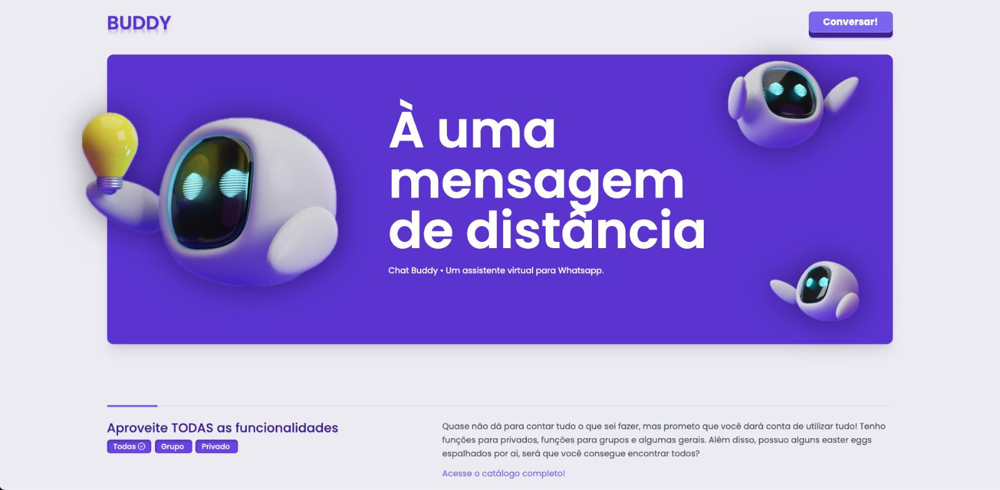

# Buddy 🤖💜

Buddy é mais do que apenas um assistente virtual para o WhatsApp baseado em IA; ele aproveita a tecnologia ChatGPT para alguns comandos, mas suas capacidades vão muito além disso. Com um número crescente de usuários, Buddy executa uma variedade de funcionalidades para tornar a experiência ainda mais dinâmica. 🚀💬

## Funcionalidades

| Func                       | Command                                   | Description                                           |
|:--------------------------:|:-----------------------------------------:|:-----------------------------------------------------:|
| Ping                       | `ping`                                    | Responde com um pong.                                 |
| MentionEveryone            | `@todos`                                  | Menciona todos os usuários.                           |
| MentionOnlyAdmins          | `@admins`                                 | Menciona todos os admins do grupo.                    |
| GroupInformation           | `info`                                    | Retorna as informações do grupo.                      |
| ListParticipants           | `participants`                            | Retorna a lista de participantes do grupo.            |
| DeleteMessage              | `apagar + mensagem mencionada`            | Apaga mensagem mencionada, se possível.               |
| ClearChat                  | `limpar`                                  | Apaga o conteúdo do chat do Buddy.                    |
| HelpCommand                | `ajuda`                                   | Envia catálogo de comandos.                           |
| LeaveGroup                 | `sair`                                    | Sai do grupo.                                         |
| JoinGroup                  | `entrar + link`                           | Entra em um grupo.                                    |
| ImagineCommand             | `imagine + prompt`                        | Retorna uma imagem gerada pela IA.                    |
| ImageAsSticker             | `figurinha (imagem ou gif)`               | Retorna a mídia em formato de figurinha.              |
| ImageTranscription         | `transcrever + menção à imagem`           | Transcreve o texto na imagem para texto normal.       |
| AudioTranscription         | `transcrever + menção ao áudio`           | Transcreve o conteúdo do áudio em texto.              |
| DownloadVideos             | `video + link`                            | Baixa o vídeo para o chat.                            |
| GeneratePoll               | `enquete + prompt`                        | Cria uma enquete interativa nativa do WhatsApp.      |
| PackageTracking            | `rastreio + código`                       | Traz as informações atuais do pacote em questão.     |
| AddressByCEP               | `endereço + CEP`                          | Traz as informações do endereço com base no CEP.      |
| SecretFriend               | `amigo-secreto`                           | Embaralha os integrantes do grupo e cria um amigo-secreto. |
| Feedback                   | `feedback + texto`                        | Envia uma mensagem ao desenvolvedor.                 |
| Paywall                    | `pay + link`                              | Retorna um link sem paywall.                          |
| BanUser                    | `remover + @usuário`                      | Remove o @usuário do grupo.                          |
| PromoteUser                | `promover + @usuário`                     | Promove o @usuário do grupo.                         |
| DemoteUser                 | `rebaixar + @usuário`                     | Rebaixa o @usuário do grupo para usuário comum.      |
| CloseGroup                 | `fechar grupo`                            | Apenas adms podem mandar mensagem no grupo.          |
| OpenGroup                  | `abrir grupo`                             | Todos podem mandar mensagem no grupo.                |
| CreateQrCode               | `qrcode + conteúdo`                       | Retorna um QR code com base no conteúdo (link, por exemplo). |
| ToReveal                   | `revelar + menção à mídia de visualização única (áudio, vídeo, gif, imagem...)` | Traz a mídia sem ser de visualização única.          |
| ForwardedAudioTranscription| -                                         | Áudio encaminhado ao privado será transcrito automaticamente. |
| GetInviteForGroup          | `convite`                                 | Retorna o convite do grupo, se possível.             |
| ResumeMessagesFromGroup    | `resumir X`                               | Resume as últimas X mensagens do grupo.              |
| CreateReminders            | `lembrete + o lembrete`                   | Cria um lembrete.                                    |
| Talk                       | `talk: + pergunta`                        | Retorna a resposta em formato de áudio gerado por IA. |
| ReplyMessageWithGPT        | -                                         | Padrão: Resposta à pergunta com base no ChatGPT.     |